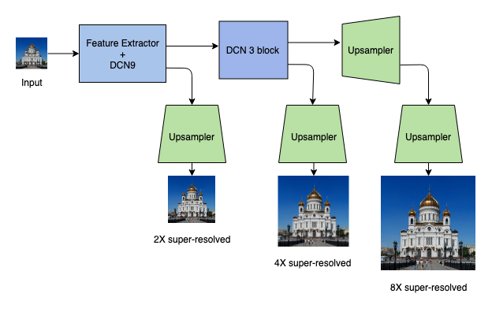

# Didactic Supervised Super-resolution

## Introduction

This project incorporates a supervised super-resolution scheme by having the process of super-resolving the image to a slightly lesser resoltion. This approach allows the model to learn necessary features at each scale of resolution.This work is highly inspired by  [Yifan Wang et-al](https://igl.ethz.ch/projects/prosr/) who followed a simillar progressive super-resolution approach.

This repository contains the pytorch implementation of a sequential super resolution algorithm.The architecture and implementation detail are present in the report in the repository

## Architecture

The architecture is a progressive upsampler which uses a [Desely connected Convolutional Neural network](https://arxiv.org/abs/1608.06993) as a feature extractor between intermediate steps. DCN in the figure stands for Desely connected Convolutional Neural network. The model is initialised from scratch.



<center> Architecture of the CNN used </center>
## Data Preperation and execution

### Training

The only data that you need to provide for the training are the high resolution images. Make sure they are in '.png' format. To kick start the training and generate the checkpoint run the following command.

```shell
$python3 tain.py
```
### Testing

Place your low resolution images to be upscaled into the valid folder and expect the reults in the folders 'result2', 'result4' and 'result8'. Feel free to use [our checkpoint](https://drive.google.com/open?id=152qfdtzwZsgrSQZzdVTPRgO3-tIPWgs7) and in that case replace the 'Checkpoint' diirectory with the aforementioned file.
```shell
$python3 test.py
```

## Getting Started
Copy the entire high res training dataset in png format in a folder called data in the working directory
Copy the low res image to be upscaled in the valid directory in the workspace


## Results
|                             ----                             |                             ---                              |
| :----------------------------------------------------------: | :----------------------------------------------------------: |
| 2X super-resolved | 4X super-resolved |
| 8X super-resolved |  Groud Truth  |
|                             ----                             |                             ----                             |
| 2X super-resolved | 4X super-resolved |
| 8X super-resolved | Ground Truth  |
|                             ----                             |                             ----                             |
| 2X super-resolved | 2X super-resolved |
| 8X super-resolved | Ground Truth  |
|                             ----                             |                             ----                             |


